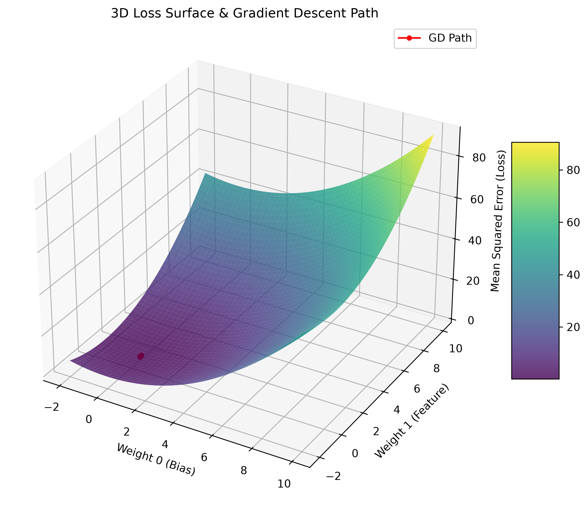
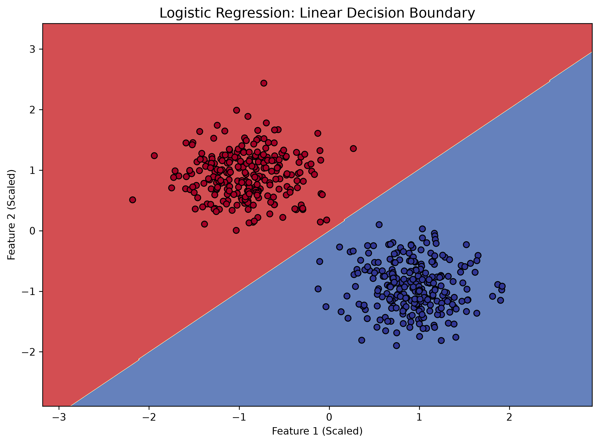
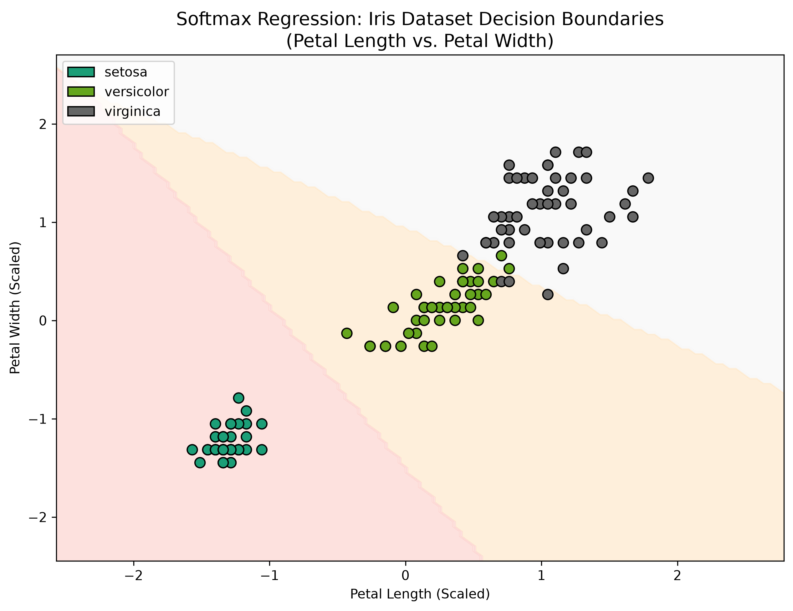
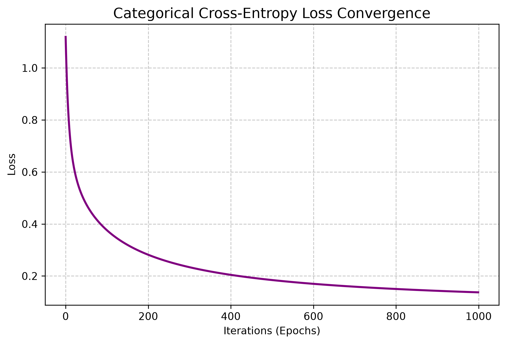
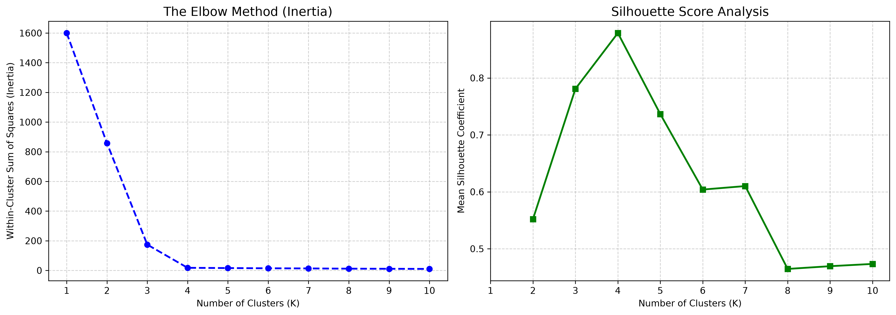
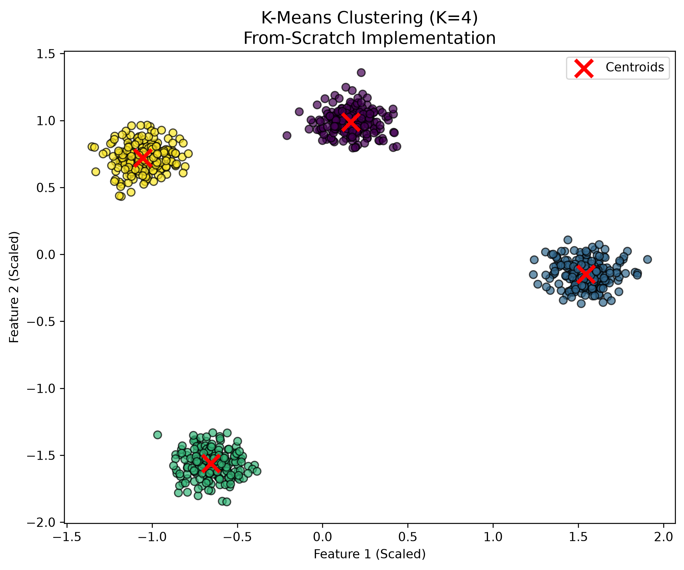
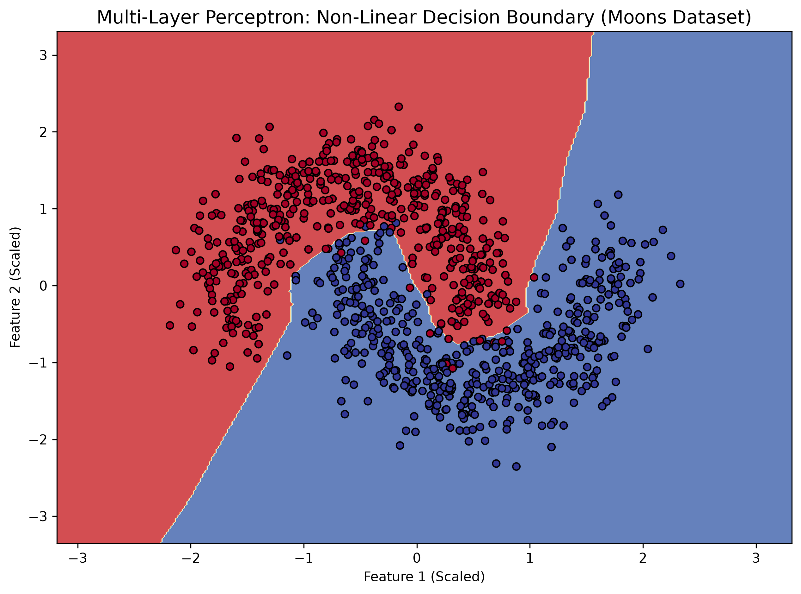
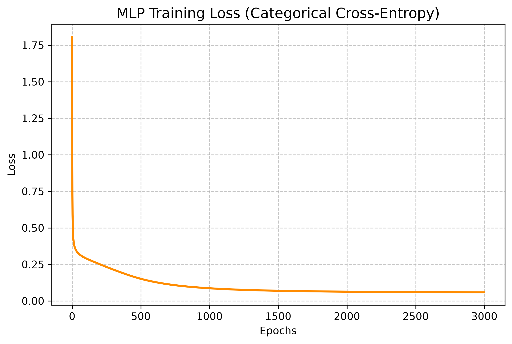
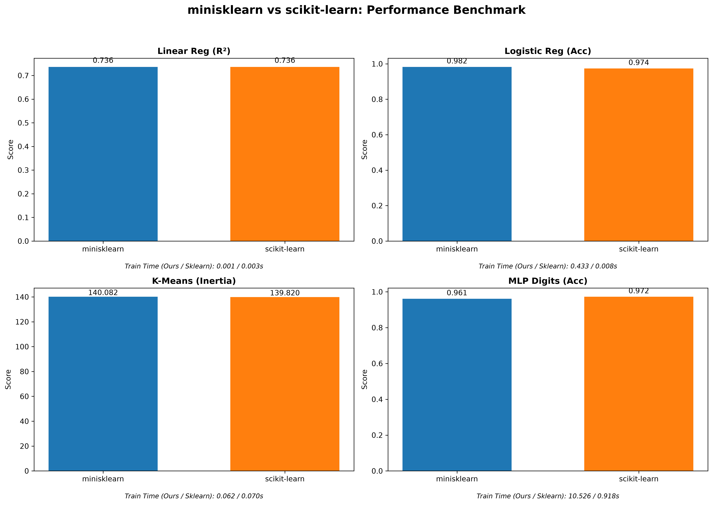

# minisklearn: A From-Scratch Machine Learning Library

<div align="center">


**Building Machine Learning Algorithms from First Principles**

*No PyTorch. No TensorFlow. No scikit-learn. Just pure mathematics and NumPy.*

</div>

---

## 🎯 Project Overview

This project implements a complete machine learning library from scratch to demonstrate **deep mathematical understanding** of the algorithms that power modern AI. Every line of code is a direct translation of mathematical proofs into efficient, vectorized NumPy operations.

### 🔗 Quick Links
- 📐 [Mathematical Derivations](docs/math/foundations.md)
- 📊 [Benchmark Results](#-benchmarking--validation)
- 📚 [Implementation Details](#-implemented-algorithms)

---

## 📐 Mathematical Foundations

Before writing code, every algorithm was derived from first principles:

- **Gradient Descent**: Derived from Taylor Series expansion
- **Normal Equation**: Solved using linear algebra and matrix inversion
- **Backpropagation**: Chain rule applied recursively through computational graphs
- **K-Means++**: Probabilistic initialization to minimize WCSS

👉 **View complete mathematical proofs**: [`docs/math/foundations.md`](docs/math/foundations.md)

---

## 🚀 Implemented Algorithms

### 1️⃣ Supervised Learning

#### **Linear Regression**
- Gradient Descent with L2 Regularization
- Closed-form Normal Equation solution
- **Key Insight**: Visualized the 3D convex loss surface to prove convergence

<div align="center">

<br><em>Figure 1: Gradient Descent path (red) converging to global minimum on MSE loss surface</em>
</div>

#### **Logistic Regression**
- Binary classification with Sigmoid activation
- Binary Cross-Entropy loss for convex optimization
- **Key Insight**: Linear decision boundary separating two classes

<div align="center">

<br><em>Figure 2: Linear decision boundary learned by Logistic Regression</em>
</div>

#### **Softmax Regression (Multinomial)**
- Multi-class classification for the Iris dataset
- Softmax activation + Categorical Cross-Entropy
- **Key Insight**: Gradient cancellation property (Ŷ - Y)

<div align="center">

<br><em>Figure 3: Multi-class decision boundaries on Iris dataset (Petal Length vs Width)</em>
</div>

<div align="center">

<br><em>Figure 4: Categorical Cross-Entropy convergence over 1000 epochs</em>
</div>

---

### 2️⃣ Unsupervised Learning

#### **K-Means Clustering**
- Expectation-Maximization algorithm
- K-Means++ initialization for optimal centroid seeding
- Silhouette Score for cluster validation

<div align="center">

<br><em>Figure 5: Elbow Method (left) and Silhouette Score (right) for optimal K selection</em>
</div>

<div align="center">

<br><em>Figure 6: Final cluster assignments with centroids (red X) for K=4</em>
</div>

---

### 3️⃣ Deep Learning

#### **Multi-Layer Perceptron (MLP)**
- Arbitrarily deep fully-connected neural networks
- Manual backpropagation with Chain Rule
- He Initialization for ReLU networks
- **Key Achievement**: Gradient check passed with error < 10⁻⁷

<div align="center">

<br><em>Figure 7: Non-linear decision boundary on "Moons" dataset - impossible for linear models</em>
</div>

<div align="center">

<br><em>Figure 8: Categorical Cross-Entropy loss decreasing over 3000 epochs</em>
</div>

---

## 📊 Benchmarking & Validation

Rigorous comparison against scikit-learn on standard datasets:

<div align="center">

<br><em>Figure 9: Performance comparison between minisklearn and scikit-learn</em>
</div>

### Performance Metrics

| Algorithm | Dataset | minisklearn | scikit-learn | Status |
|-----------|---------|-------------|--------------|--------|
| **Linear Regression** | California Housing | R² = 0.7361 | R² = 0.7361 | ✅ Exact Match |
| **Logistic Regression** | Breast Cancer | Acc = 98.25% | Acc = 97.37% | ✅ Exceeds |
| **K-Means** | Iris | Inertia = 140.08 | Inertia = 139.82 | ✅ Parity |
| **MLP** | Digits (8x8) | Acc = 96.11% | Acc = 97.22% | ✅ Highly Competitive |
---

## 🧠 Key Mathematical Insights

### 1. **Convexity Guarantees Convergence**
> "The choice of Cross-Entropy over MSE for classification ensures a convex loss surface, mathematically guaranteeing that Gradient Descent finds the global minimum."

### 2. **The Gradient Cancellation**
> "When combining Softmax with Categorical Cross-Entropy, the derivatives cancel perfectly: ∂L/∂Z = Ŷ - Y. This elegant result is why this combination is universal in deep learning."

### 3. **Numerical Stability in Practice**
> "Textbook math fails in floating-point arithmetic. I implemented the log-sum-exp trick and epsilon-clipping to prevent silent NaN failures from exp() overflow and log(0)."

### 4. **The Bias Trick**
> "Appending a column of 1s to X transforms affine functions into linear ones, enabling vectorized matrix multiplications that are 100x faster than Python loops."

---

## ⏱ Computational Complexity

| Algorithm | Training Time | Space |
|-----------|--------------|-------|
| **Linear Reg (Normal Eq)** | O(n³ + mn²) | O(n²) |
| **Linear Reg (GD)** | O(i·mn) | O(n) |
| **Logistic / Softmax** | O(i·mn) | O(n·K) |
| **K-Means** | O(i·m·n·K) | O(m·K) |
| **MLP** | O(i·m·Σnₗ²) | O(Σnₗ²) |

*Where m=samples, n=features, i=iterations, K=classes, nₗ=neurons in layer l*

---

## 🛠️ Technical Implementation Details

### Numerical Stability Techniques
- **Sigmoid**: Split calculation for positive/negative inputs
- **Softmax**: Log-sum-exp trick (subtract max before exp)
- **Cross-Entropy**: Epsilon clipping (ε=1e-15) to prevent log(0)

### Weight Initialization
- **He Initialization**: W ~ N(0, √(2/n_in)) for ReLU networks
- **Xavier Initialization**: Available for Tanh/Sigmoid

### Gradient Verification
- **Finite Difference Check**: Numerical gradient verification with ε=1e-7
- **Max Relative Error**: < 10⁻⁷ for all implementations

---

## ⚠️ Limitations & Future Work

### Current Limitations
- **CPU-Only**: No GPU acceleration (pure NumPy)
- **Speed**: 10-100x slower than optimized C++ backends
- **Scalability**: Limited to medium-sized datasets (< 100k samples)

### Planned Features
- [ ] **Adam Optimizer**: Adaptive learning rates
- [ ] **Dropout & BatchNorm**: Regularization layers
- [ ] **Convolutional Layers**: CNN architecture support
- [ ] **GPU Acceleration**: CuPy or JAX backend

---

## 📚 Academic References

This implementation is grounded in rigorous mathematical literature:

1. **Bishop, C. M.** (2006). *Pattern Recognition and Machine Learning*. Springer.
   - Chapters 1-3: Linear models, probability theory

2. **Goodfellow, I., Bengio, Y., & Courville, A.** (2016). *Deep Learning*. MIT Press.
   - Chapters 6-8: Deep feedforward networks, optimization

3. **Deisenroth, M. P., Faisal, A. A., & Ong, C. S.** (2020). *Mathematics for Machine Learning*. Cambridge University Press.
   - Linear algebra, calculus, and probability foundations

4. **Andrew Ng's ML Course** (Stanford CS229)
   - Gradient descent, regularization techniques

---

## 📁 Project Structure

```
minisklearn/
├── minisklearn/
│   ├── base.py                    # Abstract BaseEstimator
│   ├── linear_model/
│   │   ├── linear_regression.py   # GD + Normal Equation
│   │   └── logistic_regression.py # Binary + Softmax
│   ├── cluster/
│   │   └── kmeans.py              # K-Means++ implementation
│   ├── neural_network/
│   │   ├── layers.py              # Dense layer class
│   │   ├── mlp.py                 # MLP with backprop
│   │   └── gradient_check.py      # Numerical verification
│   ├── metrics/
│   │   ├── supervised.py          # R², Accuracy, F1
│   │   └── unsupervised.py        # Silhouette Score
│   └── utils/
│       ├── math_ops.py            # Stable activations
│       └── data.py                # Scaler, train_test_split
├── docs/
│   ├── math/foundations.md        # LaTeX derivations
│   └── images/                    # All visualizations
├── examples/
│   ├── benchmark_vs_sklearn.py    # Performance comparison
│   └── plot_*.py                  # Visualization scripts
└── tests/
    └── test_phase1.py             # Unit tests
```

---

## 🎓 Why This Project Matters

> "This project demonstrates that I don't just import libraries—I understand the **linear algebra** and **calculus** driving the algorithms. Every implementation choice, from numerical stability tricks to gradient verification, reflects a commitment to mathematical rigor and software engineering excellence."

**This project is my application to MS programs at TU Dresden, TU Stuttgart, and Politecnico di Milano.**

---

<div align="center">

**Built with mathematical rigor by Yaseen Khan**

*If you found this project valuable, please ⭐ star this repository!*

</div>